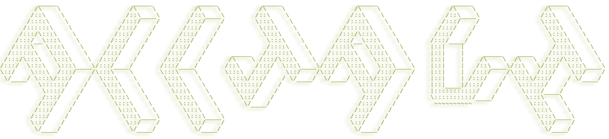
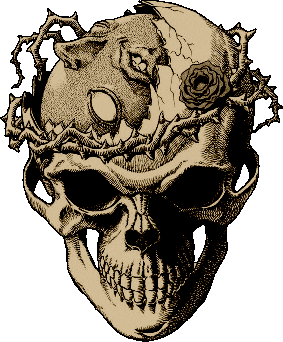

  
     
  

## 📪 Find me at:

## ⚡️ A Few Quick **Facts**

- 🌱 I'm currently working on personal projects
-  I enjoy working on:
    -  Red team
    - 📱 Full Stack Mobile App/Web Development
    - 🐍 Python algorithm/automatization proyects
    - 🛠 DIY Electronics Projects
    - 🤖 Robotics
    -  🏴 CTFs and problem solving in general
- 🧠 I enjoy self-education and learning new things on my own
-  I like to design and print 3d pieces
- 📈 I have been worked on multiple Startups
- 🖌 I have experience in graphic design
- 🎓 I hold a degree in Telecommunications Technologies and Services Engineering
- 🔒 I hold a Master's degree in cybersecurity

## 🖥️ My DevSetup
         

## ️⚙️ Some Tool and Tech I use

